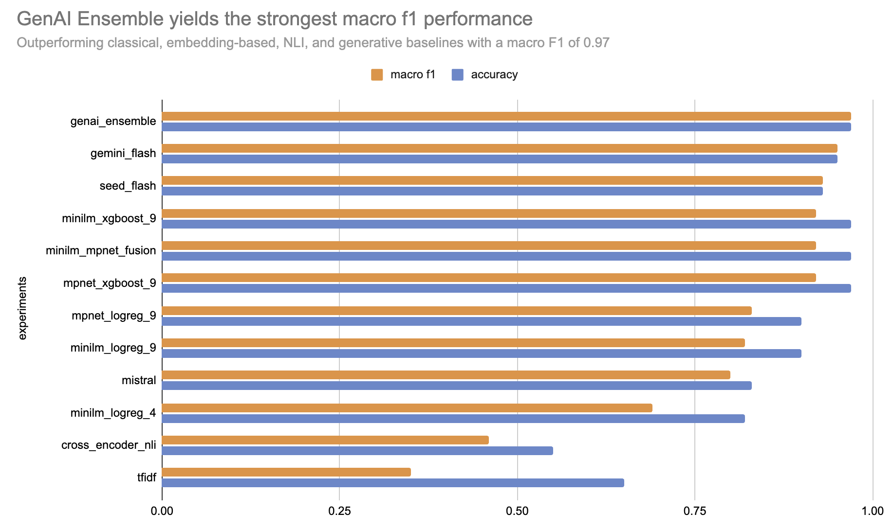

# 4th Annual Data4Good Analytics Case Competition

**Team:** Team Wake  
**Members:** Alli Ajagbe, Vikas Kumar, Jim Appiah

---

## Project Overview
This project addresses the task of **answer type classification**, where the goal is to determine whether an answer is **factual**, **contradictory**, or **irrelevant** given a question–context–answer triple. The work was developed as part of the **Data4Good Analytics Challenge**, with a strong focus on empirical evaluation, model comparison, and practical performance optimization.

We explored a progression of approaches ranging from traditional NLP baselines to sentence-embedding-based classifiers and, ultimately, a **generative AI ensemble**, which delivered the strongest performance.

---

## Key Contributions
- Systematic comparison of **traditional**, **embedding-based**, and **generative AI** approaches
- Efficient feature engineering using semantic similarity, lexical overlap, and linguistic cues
- Use of **MiniLM** and **MPNet** sentence embeddings combined with linear and tree-based classifiers
- A **Generative AI ensemble** (Gemini Flash, Mistral, Seed-Flash) achieving a **macro-F1 score of 0.9667**
- Extensive validation, feature importance analysis, and error investigation

---

## Repository Structure
```
workspace/
│
├── data/
│ ├── train.json
│ └── test.json
│
├── Data4Good.png
├── notebook.ipynb # main experimentation notebook
├── modelComparison.ipynb
├── promptTemplate.txt # Prompt used for genAI inference
├── TeamWakeCodeReport.pdf
└── readme.md
```

---

## Methodology Overview

### 1. Baseline Models
We began with classical NLP baselines to establish reference performance:

- **TF-IDF + Linear Models**
- **Cross-NLI**

While useful as sanity checks, these methods struggled to capture deeper semantic relationships.

| Approach   | Macro-F1 |
|-----------|----------|
| TF-IDF    | ~0.35    |
| Cross-NLI | ~0.45    |

---

### 2. Sentence Embeddings + Classical ML
Next, we extracted dense semantic representations using:

- **MiniLM**
- **MPNet**

These embeddings were combined with:
- Logistic Regression
- XGBoost

Feature sets included:
- Semantic similarities (answer–context, answer–question, question–context)
- Lexical overlap features
- Negation and number mismatch indicators

**Best performance in this category:**
- **MiniLM + XGBoost → Macro-F1 ≈ 0.92**

---

### 3. Generative AI Ensemble (Final Approach)
To address the limitations of feature-based classifiers—particularly for subtle contradictions and nuanced reasoning—we adopted a **generative AI–driven approach**.

Models used:
- **Gemini Flash**
- **Mistral**
- **Seed-Flash**

Predictions from these models were ensembled to improve robustness and reduce individual model bias.

**Final Performance:**
- **Macro-F1: 0.9667**

This approach demonstrated superior contextual understanding and reasoning capability, especially for minority and edge cases.

---
## Model Comparison


## Evaluation
- **Metric:** Macro-averaged F1 score  
- **Rationale:** Robust to class imbalance in the dataset  
- Multiple validation experiments and error analyses were conducted prior to final submission.

---

## How to Run

1. Clone the repository
2. Place `train.json` and `test.json` in the `data/` directory
3. Open and run:
   - `notebook.ipynb` for end-to-end experiments
   - `modelComparison.ipynb` for comparative analysis
4. Use `promptTemplate.txt` for generative AI inference
5. Final predictions are generated in JSON format, preserving **all original columns**, including `id` and `type`

---

## Report
For a detailed explanation of experiments, modeling decisions, insights, and final recommendations, refer to:

📎 **TeamWakeCodeReport.pdf**

---

## Conclusion
This project demonstrates that while traditional and embedding-based models provide strong baselines, **generative AI ensembles unlock substantial performance gains** for reasoning-intensive NLP tasks. The final solution balances accuracy, robustness, and interpretability, making it well-suited for real-world deployment.

---

## Future Work
- Cost-aware optimization of generative model inference
- Prompt ensembling and self-consistency techniques
- Hybrid pipelines combining symbolic features with generative reasoning
- Error-aware re-ranking strategies for borderline cases
